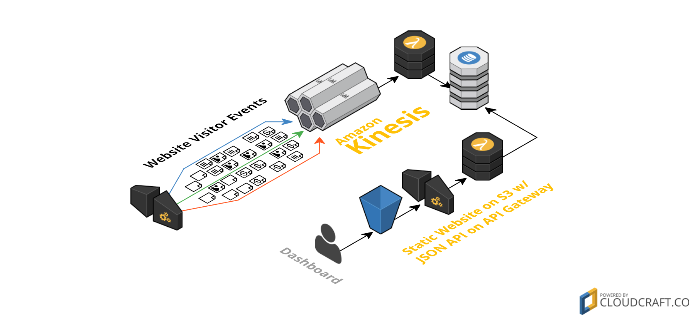

# Serverless Analytics ⚡️

[](http://www.serverless.com) 
[](LICENSE.md)

Example project for a personal [serverless](https://serverless.com) *Google Analytics* clone to track website visitors.

After deploying the service you will have a HTTP endpoint using API Gateway that accepts requests and puts them into a Kinesis Stream. A Lambda function processes the stream and writes a basic metric about how many visitors you have per absolute URL to DynamoDB.

## Components

#### Tracking Service

- Amazon Kinesis to stream visitor events
- Amazon API Gateway as HTTP proxy for Kinesis
- Amazon DynamoDB for data storage
- AWS Lambda to process visitor events

#### Examples

- Static website to track visitors
- API & Dashboard to show metrics

## Configuration

All settings can be changes in the `serverless.yml` configuration file. You can easily change the DynamoDB Table, Kinesis Stream and API Gateway Resource names:

```yaml
service: sls-analytics

custom:
  names:
    bucket: 
      website: ${self:service}-website-example
      dashboard: ${self:service}-website-dashboard
    resource: track
    dynamodb: ${self:service}-data
    kinesis: ${self:service}-stream
```

The S3 Bucket configuration is only needed for the included example website. If you don't need the example sites, have a look at the `scripts/deploy.sh` file and disable the deployment and remove the CloudFormation resources from the `serverless.yml` file.

*Amazon requires unique names for S3 buckets and other resources. Please rename at least the service before you try to deploy the example!*

## Deployment

Running `yarn deploy` will trigger a default [serverless](https://serverless.com) deployment. After the output of the CloudFormation Stack is available, the included static websites will be generated *(Using the hostname from the stack output)* and uploaded to the configured S3 buckets. As the final step, the deploy process will display the URL of the example website and data dashboard:

```bash
# Install dependencies
$ > yarn install
# Deploy 
$ > yarn deploy

[…]

Dashboard:  http://sls-analytics-website-dashboard.s3-website-us-east-1.amazonaws.com/
Website:    http://sls-analytics-website-example.s3-website-us-east-1.amazonaws.com/
```

The **website** includes a simple HTML file, some stylings, and a few JavaScript lines that send a request to your API on every page load. Visit your URL, hit a few times the refresh button and take a look at the DynamoDB table or the **dashboard** URL.

## Tracking

Basically tracking is nothing more than a HTTP request to the API Gateway with a set of payload information *(currently just `url` and `name`)*. Normally you would have a non-JS fallback, like an image e.g., but a simple `fetch` call does the job for now:

```js
fetch(
  'https://n6q0egpreh.execute-api.us-east-1.amazonaws.com/v1/track',
  {
    method: "POST",
    body: JSON.stringify( { url: location.href, name: document.title } ),
    headers: new Headers(
      {
        "Content-Type": "application/json"
      }
    )
  }
)
```

## Data Access

You can get a list of all tracked data by invoking the `list` function, or just have a look into your DynamoDB or use the included dashboard.

```bash
$ > sls invoke -f list

[
  {
    "name": "http://sls-analytics-website-example.s3-website-us-east-1.amazonaws.com/",
    "value": 10
  },
  {
    "name": "http://sls-analytics-website-example.s3-website-us-east-1.amazonaws.com/?foo=bar",
    "value": 2
  }
]
```

## Infrastructure



## License

Feel free to use the code, it's released using the [MIT license](LICENSE.md).

## Contribution

You are welcome to contribute to this project! 😘 

To make sure you have a pleasant experience, please read the [code of conduct](CODE_OF_CONDUCT.md). It outlines core values and beliefs and will make working together a happier experience.